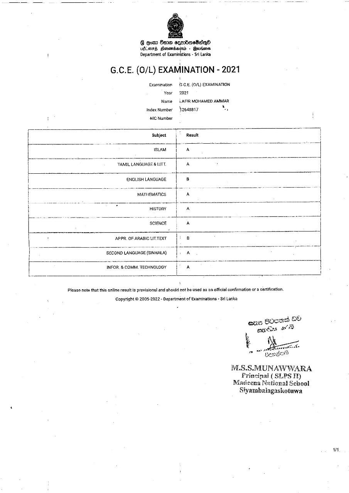
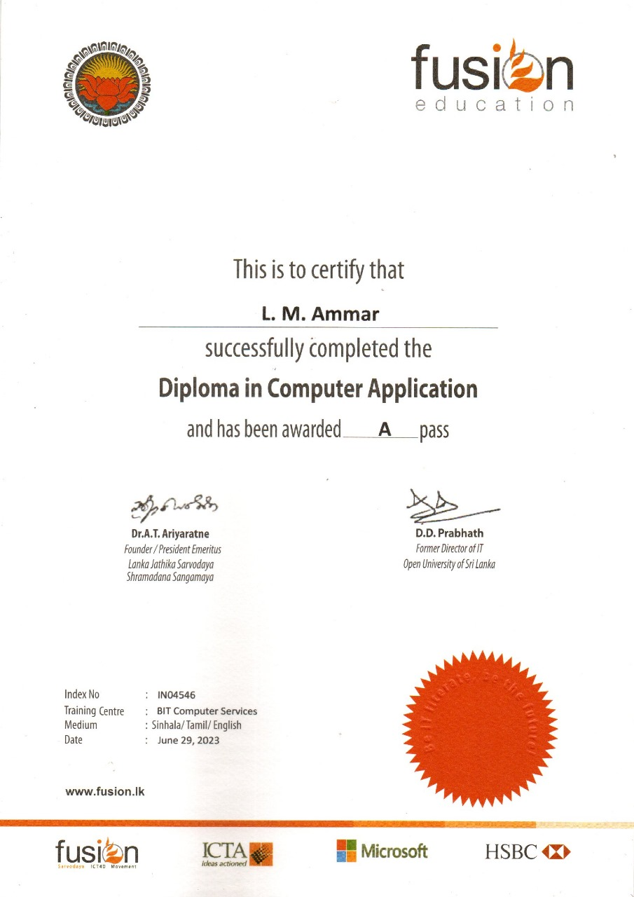
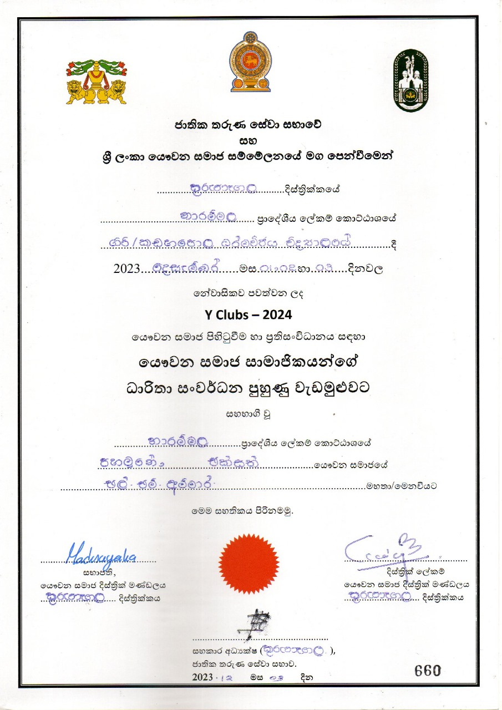
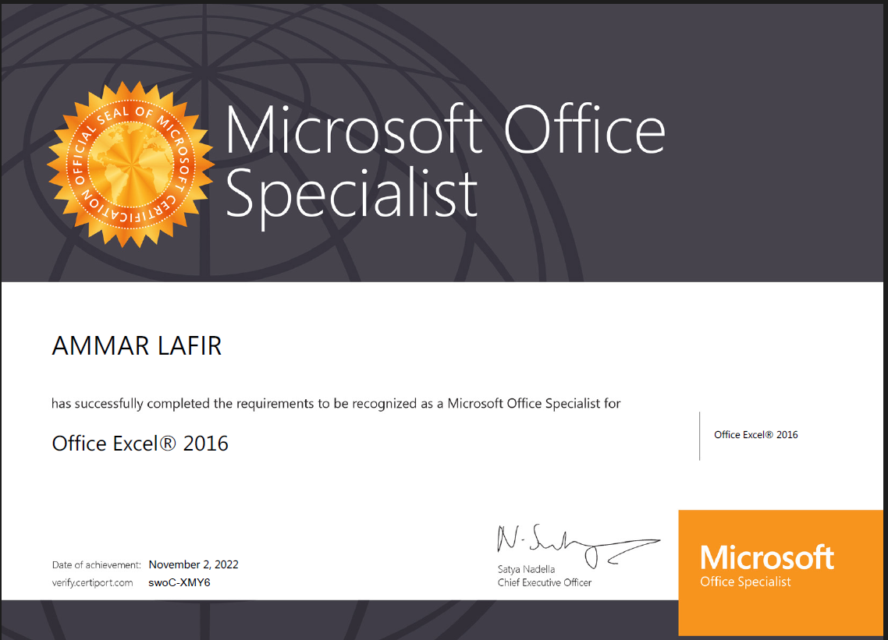
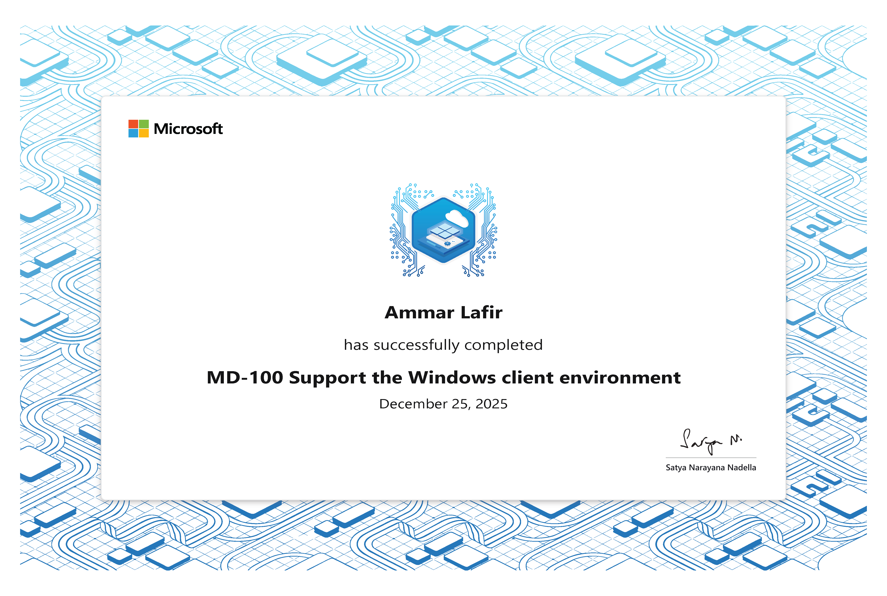
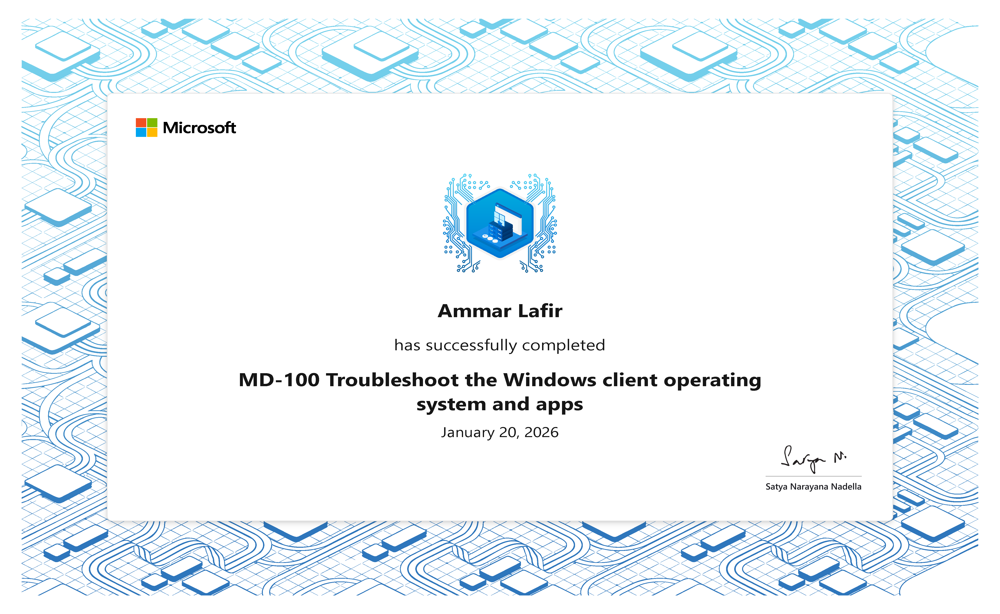
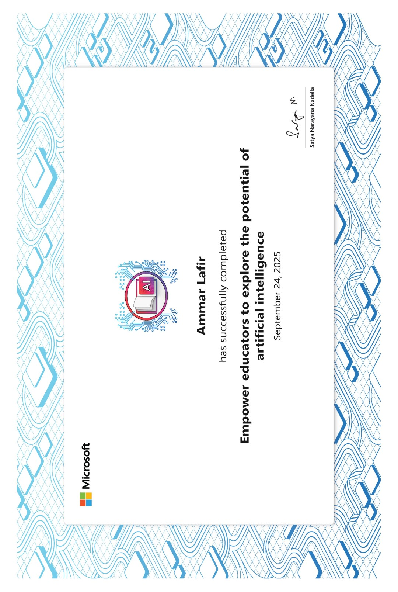
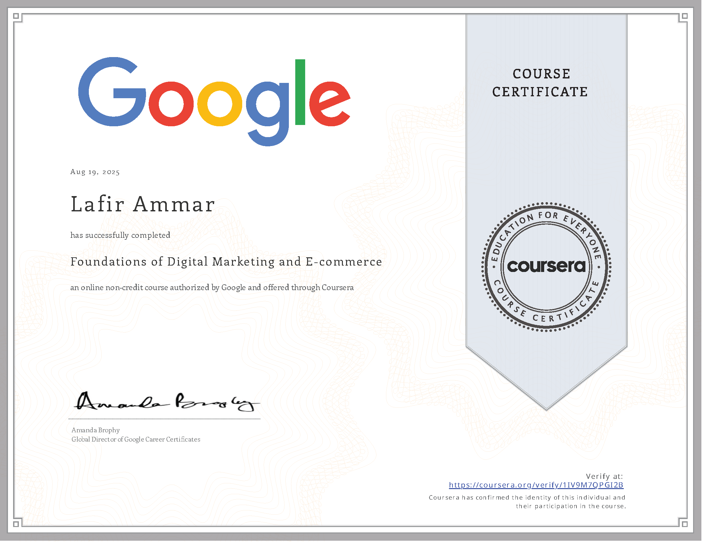
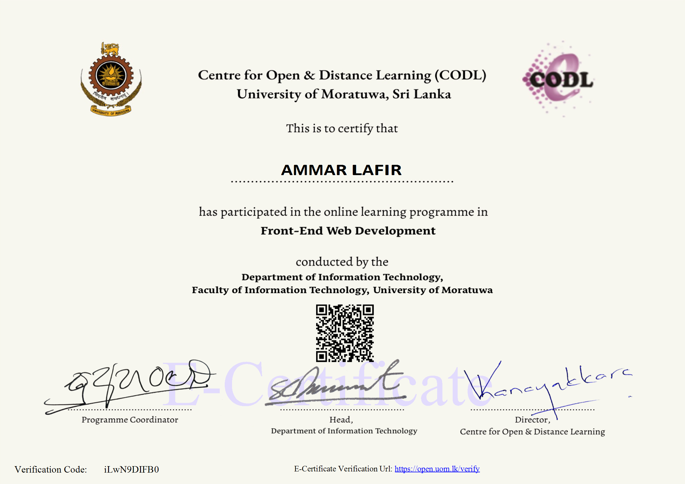

# 🎓 Ammar Lafir – Certifications & Qualifications

Welcome to my repository of academic achievements and professional certifications.  
This portfolio showcases my journey in **AI, IT support, networking, operating systems, office productivity, digital marketing, educational technology,AI in Education**.

---

## 📑 Academic Qualifications  
  
  

- **G.C.E. (O/L) Examination – 2021**  
  

- **Diploma in Computer Application (Fusion Education)**  
  

- **Youth Leadership & Participation – Y Clubs 2024**  
  

---

## 💻 Professional Certifications – Microsoft  
  
  
  

- **Microsoft Office Specialist (MOS)**  
  - Excel 2016 – *Nov 2, 2022*  
      
  - Word 2016 – *Dec 21, 2022*  
    

- **MD-100: Support the Windows Client Environment**  
  

- **MD-100: Troubleshoot the Windows Client OS and Apps**  
  

- **Empower Educators to Explore the Potential of Artificial Intelligence**  
  

---

## 🌐 Professional Certifications – Cisco Networking Academy  
  
  

- **IT Customer Support Basics**  
  [.png)](cisco/IT-SUP(1).png)  
  [.png)](cisco/IT-SUP(2).png)

- **Operating Systems Support**  
  [.png)](cisco/OS-SUP(1).png)  
  [.png)](cisco/OS-SUP(2).png)

---

## 📊 Professional Certifications – Google & Coursera  
  

- **Foundations of Digital Marketing and E-commerce**  
    
  Verified via Coursera: [Verification Link](https://coursera.org/verify/11V9M70PGI2B)

---

## 🏫 University & Institutional Programs  
  

- **Front-End Web Development – University of Moratuwa (CODL)**  
  

---

## 📂 Repository Structure

📁 certifications-portfolio

┣ 📄 README.md

┣ 📁 academic/

┣ 📁 microsoft/

┣ 📁 cisco/

┣ 📁 google-coursera/

┗ 📁 university/
